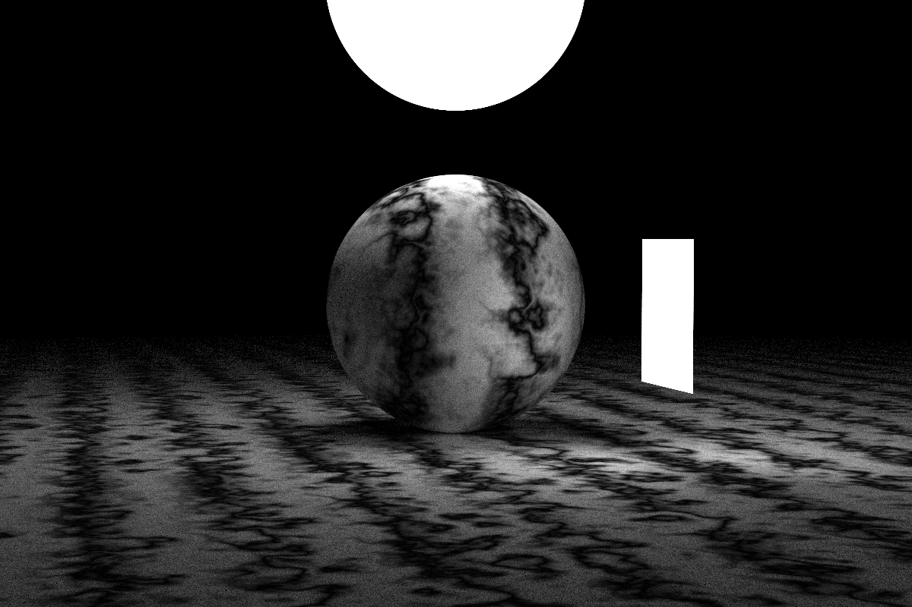
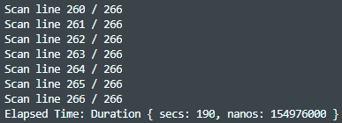
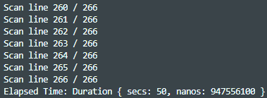

# Ray Tracing in One Weekend - Rust Edition :crab:
This is a personal Rust learning project. Giving myself a little challenge to transform [Peter Shirley](https://twitter.com/peter_shirley)'s _Ray Tracing in One Weekend Series_ into Rust code while learning the fundamental knowledge of ray tracing. 

:green_book: [_Ray Tracing in One Weekend_](https://raytracing.github.io/books/RayTracingInOneWeekend.html)

:ledger: [_Ray Tracing: The Next Week_](https://raytracing.github.io/books/RayTracingTheNextWeek.html)

:closed_book: [_Ray Tracing: The Rest of Your Life_](https://raytracing.github.io/books/RayTracingTheRestOfYourLife.html)

## Getting Started
I tried my best to comment all commits by its corresponding subsection title within the book. Sorry if I merged/skipped some programming practices. 
```shell
$ cargo build
$ cargo run
```

## Milestone



## Concurrency
By conforming to the principle of object safety, I'm using `Enums` over `Trait Objects` for a good reason. Although the syntax is ugly, the trade-off will be a boost in rendering time (based on how many cores your CPU has). 

| Single-thread (x1) | Multi-thread (x4) |
| :-----------: | :----------: |
|  |  |
